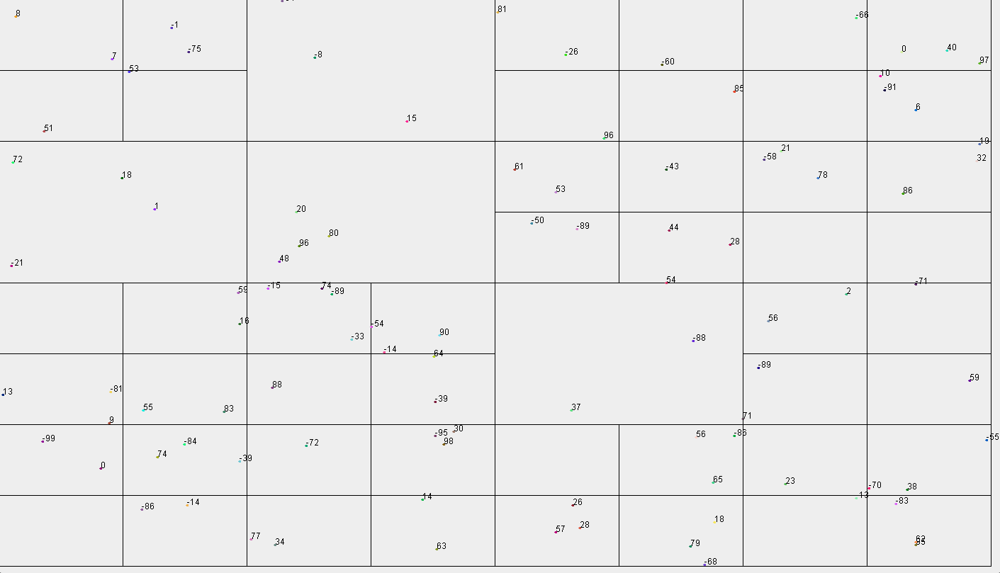
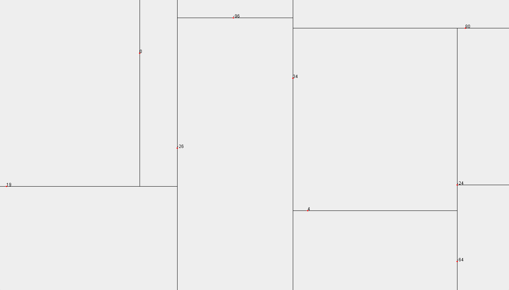

# Quad and KD Trees in Java

This project implements Quad Trees and KD Trees in Java. Those can be visualized in a GUI.

## Usage

To visualize the KD Tree, run the `KDTreeVisualization` or `QuadTreeVisualization` class. They read points from a file and display the KD Tree structure.

## Data Files
The data directory contains several text files with points for testing:

- 10000Points.txt
- 1000Points.txt
- Points_10.txt
- Points_100.txt

Each line in these files represents a point with coordinates and a label.

## Examples

Example for a Quad Tree using `Points_100.txt`:

Example for a Kd Tree using `Points_10.txt`:

